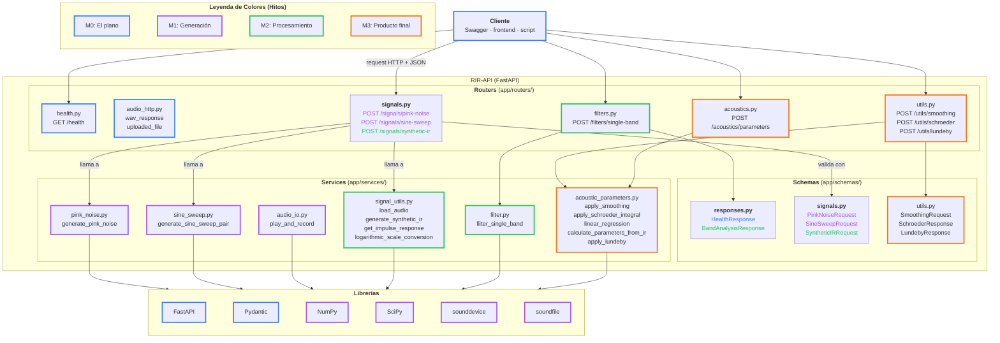

# RIR-API

API REST para procesamiento y analisis de respuestas al impulso segun la norma ISO 3382.

<!-- Badge de CI: reemplazar <usuario>/<repo> por los datos del repositorio del grupo -->


## Descripcion

RIR-API es el trabajo practico de Senales y Sistemas (UNTREF, 2C 2026): una API REST
(FastAPI) con la cadena completa de procesamiento acustico, desde la generacion de senales
de excitacion hasta el calculo de parametros acusticos (EDT, T20, T30, D50, C80) segun
ISO 3382-1.

- Consigna, especificaciones y ruta del TP: <https://maxiyommi.github.io/signal-systems/trabajo_practico/ruta/>
- API de referencia de la catedra (Swagger UI): <https://rir-api.onrender.com/docs>

> Este README es un punto de partida: el grupo lo completa en M0 (integrantes, roles,
> diagrama de arquitectura, branching strategy) y lo va actualizando hasta M3 (seccion
> "Validacion" con los resultados).

## Integrantes

| Nombre | Legajo | Rol |
|--------|--------|-----|
| Joaquin Vargas | 70837 | Tester |
| Rodrigo Sanchez | 52065 |  API Developer |
| Agustin Quaglia | 71839 | Reviewer |
| Mauro Zampietri | 61508 | Release Manager |

## Requisitos previos

- Python 3.12 o superior
- [uv](https://docs.astral.sh/uv/) (gestor de paquetes y entornos virtuales)
- git y una cuenta de GitHub

## Arranque: crear el repositorio del grupo

Cada grupo trabaja en **un repositorio nuevo propio** y copia adentro el contenido de este
template (no es un fork).

1. Una persona del grupo crea en GitHub un repositorio **vacio** (por ejemplo `rir-api`,
   sin README ni .gitignore) y agrega al resto del grupo y a los docentes
   (**@maxiyommi** y **@jero-scafati**) como colaboradores
   (*Settings → Collaborators → Add people*).
2. Copiar el template y hacer el primer commit:

```bash
# Bajar el repositorio de la materia (solo la ultima version)
git clone --depth 1 https://github.com/maxiyommi/signal-systems.git

# Clonar el repositorio (vacio) del grupo
git clone https://github.com/<usuario>/rir-api.git

# Copiar el contenido del template (incluye archivos ocultos: .github/, .gitignore)
cp -r signal-systems/trabajo_practico/template_repo/. rir-api/

cd rir-api
git add .
git commit -m "chore: estructura inicial desde el template de la catedra"
git branch -M main
git push -u origin main
```

3. El resto del grupo clona `rir-api` y listo. La carpeta `signal-systems/` se puede borrar.
uv
## Instalacion y ejecucion

```bash
# Crear el entorno e instalar dependencias (incluye las de desarrollo: pytest, ruff, ...)
uv sync

# Iniciar la API con hot-reload
uv run uvicorn app.main:app --reload

# Correr los tests
uv run pytest
```

La API queda disponible en `http://localhost:8000`. Documentacion interactiva:

- Swagger UI: `http://localhost:8000/docs`
- ReDoc: `http://localhost:8000/redoc`

`uv sync` genera un `uv.lock` con las versiones exactas instaladas: **commitéenlo** en el
repositorio del grupo para que todos (y el CI) usen las mismas versiones.

## Estructura del proyecto

```
rir-api/
├── app/
│   ├── __init__.py
│   ├── main.py                    # Punto de entrada FastAPI (/ y /health)
│   ├── settings.py                # Configuracion (pydantic-settings, variables RIR_*)
│   ├── routers/
│   │   ├── __init__.py
│   │   ├── health.py              # GET /health (M0)
│   │   └── audio_http.py          # wav_response y uploaded_file (ya resueltas)
│   ├── schemas/
│   │   └── __init__.py            # Modelos Pydantic de request/response (desde M1)
│   └── services/
│       ├── __init__.py
│       ├── pink_noise.py          # generate_pink_noise (M1)
│       ├── sine_sweep.py          # generate_sine_sweep_pair (M1)
│       ├── audio_io.py            # play_and_record (M1)
│       ├── signal_utils.py        # load_audio, generate_synthetic_ir, get_impulse_response,
│       │                          # logarithmic_scale_conversion (M2)
│       ├── filter.py              # filter_single_band (M2)
│       └── acoustic_parameters.py # apply_smoothing, apply_schroeder_integral, linear_regression,
│                                  # calculate_parameters_from_ir, apply_lundeby (M3)
├── tests/
│   ├── data/                      # WAV chicos de prueba (se versionan)
│   ├── test_placeholder.py        # Test trivial (M0)
│   ├── test_generacion.py         # Tests de M1
│   ├── test_procesamiento.py      # Tests de M2
│   ├── test_analisis.py           # Tests de M3 (services)
│   └── test_api.py                # Tests de endpoints, por milestone (M0 a M3)
├── data/                          # Mediciones y audios locales (ignorado por git)
├── docs/
│   └── README.md                  # Guia para la documentacion (graficas de validacion, etc.)
├── .github/workflows/ci.yml       # CI: ruff + pytest en cada push/PR
├── .gitignore
├── pyproject.toml                 # Dependencias y configuracion (ruff, pytest)
└── README.md
```

Cada milestone expone lo que construye: los routers y schemas de `signals` se agregan en M1
(y suman `synthetic-ir` en M2), los de `filters` en M2 y los de `acoustics` y `utils` en M3
(ver los `TODO` en `app/main.py`).

## Diagrama de arquitectura


## Branching Strategy

Para el desarrollo de la API, el equipo utilizará una estrategia basada en **Feature Branches** combinada con **Pull Requests**, asegurando que el código principal siempre sea estable y funcional. 

Las reglas del flujo de trabajo son las siguientes:

### 1. Rama Principal (`main`)
Es la rama base del proyecto. El código aquí siempre debe funcionar y pasar todos los tests.
> **Regla estricta:** Ningún integrante del equipo puede hacer un `git push` directo a `main`.

### 2. Ramas de Desarrollo (Feature Branches)
Para cada tarea nueva (issue, señal, endpoint), el desarrollador responsable debe crear una rama aislada a partir de `main`.
* **Nomenclatura:** Se usará el prefijo `feature/` seguido del nombre de la tarea.
* **Ejemplos:** `feature/ruido-rosa`, `feature/sine-sweep`.

### 3. Integración mediante Pull Requests (PR)
Una vez terminada la tarea en la rama local, se sube a GitHub y se abre un Pull Request hacia `main`. 

Para que el PR sea aprobado e integrado (*Merge*), debe cumplir dos condiciones obligatorias:
* **Aprobación de Integración Continua (CI):** GitHub Actions debe dar luz verde confirmando que el linter (`Ruff`) y los tests (`Pytest`) pasaron exitosamente.
* **Code Review:** Al menos un compañero del equipo (preferentemente con el rol de *Reviewer*) debe revisar el código y aprobar el PR.


## Milestones y entregas (2C 2026)

| Milestone | Entrega | Tag | Evaluacion |
|-----------|---------|-----|------------|
| **M0 · El plano** (arquitectura) | mie 7/10 (asincronica, por Slack/GitHub) | — | Seguimiento, sin nota |
| **M1 · Generacion de senales** | mie 28/10 (en clase) | `v0.1.0` | Seguimiento, sin nota |
| **M2 · Procesamiento de la RI** | mie 4/11 | `v0.2.0` | Seguimiento, sin nota |
| **M3 · Producto final** + presentacion oral | mie 18/11 | `v1.0.0` | **Nota del TP: 60 % M3 + 40 % oral** |

- No hay informe escrito: la validacion de resultados va en una seccion **"Validacion"** de
  este README.
- **`AI_LOG.md`** en la raiz del repositorio es **obligatorio** (sin nota propia, pero sin
  `AI_LOG.md` M3 no se considera completo): registren el uso de herramientas de IA durante
  todo el proyecto.
- Detalle de cada milestone: <https://maxiyommi.github.io/signal-systems/trabajo_practico/ruta/>

### M0 · El plano

- [ ] Repositorio del grupo creado a partir del template, con los docentes como colaboradores.
- [ ] `uv sync`, `uv run uvicorn app.main:app --reload` y `uv run pytest` funcionan.
- [ ] README con integrantes y roles, instalacion, estructura y branching strategy.
- [ ] Diagrama de arquitectura (Mermaid o draw.io) con todos los modulos de M1, M2 y M3.
- [ ] Al menos 10 issues con labels (`milestone-1`, `milestone-2`, `milestone-3`) y asignados.

### M1 · Generacion de senales (`v0.1.0`)

- [ ] `generate_pink_noise()` en `app/services/pink_noise.py` (Voss-McCartney recomendado).
- [ ] `generate_sine_sweep_pair()` (sweep + filtro inverso) en `app/services/sine_sweep.py`.
- [ ] `play_and_record()` en `app/services/audio_io.py`.
- [ ] Endpoints `POST /api/v1/signals/pink-noise` y `POST /api/v1/signals/sine-sweep` (devuelven WAV),
      con sus schemas en `app/schemas/signals.py`.
- [ ] Tests de `tests/test_generacion.py` y los de M1 en `tests/test_api.py` pasando;
      graficas de validacion en `docs/m1/`.

### M2 · Procesamiento de la RI (`v0.2.0`)

- [ ] `load_audio()`, `generate_synthetic_ir()`, `get_impulse_response()` y
      `logarithmic_scale_conversion()` en `app/services/signal_utils.py`.
- [ ] `filter_single_band()` en `app/services/filter.py`.
- [ ] Endpoints `POST /api/v1/signals/synthetic-ir` y `POST /api/v1/filters/single-band`
      (recibe un WAV subido).
- [ ] Tests de `tests/test_procesamiento.py` y los de M2 en `tests/test_api.py` pasando.

### M3 · Producto final (`v1.0.0`)

- [ ] `apply_smoothing()`, `apply_schroeder_integral()`, `linear_regression()` y
      `calculate_parameters_from_ir()` en `app/services/acoustic_parameters.py`.
- [ ] Endpoints `POST /api/v1/acoustics/parameters`, `POST /api/v1/utils/schroeder` y
      `POST /api/v1/utils/smoothing`: la API completa.
- [ ] Tests de `tests/test_analisis.py` y todos los de `tests/test_api.py` pasando.
- [ ] Seccion "Validacion" en este README, `AI_LOG.md` y presentacion oral.
- [ ] (Opcional) `apply_lundeby()`.

## Tests

Las funciones de `app/services/` vienen como *stubs* que lanzan `NotImplementedError`. Sus
tests estan marcados como `xfail` (fallo esperado), asi el CI queda en verde desde el
primer dia:

- Mientras la funcion no este implementada, el test aparece como `x` (xfailed).
- Cuando la implementen bien, aparece como `X` (xpassed). En ese momento conviene **borrar
  la marca `xfail`** del modulo de tests (`pytestmark = ...`) para que el test cuente como
  un test normal. En `tests/test_api.py` la marca va test por test (`@xfail_m1`,
  `@xfail_m2`, `@xfail_m3`): borren la de cada endpoint que implementen.
- Si la implementacion es incorrecta, el test **falla** (rojo) con el `AssertionError`.

```bash
uv run pytest                                  # todos los tests
uv run pytest -v tests/test_generacion.py      # un archivo, con detalle
uv run pytest -v -k pink_noise                 # tests cuyo nombre contiene "pink_noise"
uv run pytest -rxX                             # listar xfailed / xpassed
uv run pytest --cov=app                        # con cobertura
```

`play_and_record` se testea con un *mock* de `sounddevice`, por lo que el CI no necesita
placa de audio. Para probarla de verdad, corran la funcion localmente con un parlante y un
microfono y documenten la configuracion (dispositivo, canales, fs, buffer size).

## Linter y formato

```bash
uv run ruff check app/ tests/          # verificar estilo
uv run ruff check --fix app/ tests/    # corregir lo automatico
uv run ruff format app/ tests/         # formatear
```

El CI (`.github/workflows/ci.yml`) corre `ruff check`, `ruff format --check` y
`pytest --cov=app` en cada push a `main` y en cada pull request.

## Configuracion

`app/settings.py` define la configuracion con `pydantic-settings`. Cualquier valor se puede
sobreescribir con variables de entorno con prefijo `RIR_` (por ejemplo `RIR_FS_DEFAULT=44100`)
o con un archivo `.env` en la raiz (ignorado por git).

## Referencias

- ISO 3382-1:2009 — Acoustics — Measurement of room acoustic parameters.
- Farina, A. (2000). *Simultaneous measurement of impulse response and distortion with a
  swept-sine technique.* 108th AES Convention.
- Schroeder, M. R. (1965). *New method of measuring reverberation time.* JASA 37(3).
- [FastAPI](https://fastapi.tiangolo.com/) · [Pydantic](https://docs.pydantic.dev/) ·
  [uv](https://docs.astral.sh/uv/)
